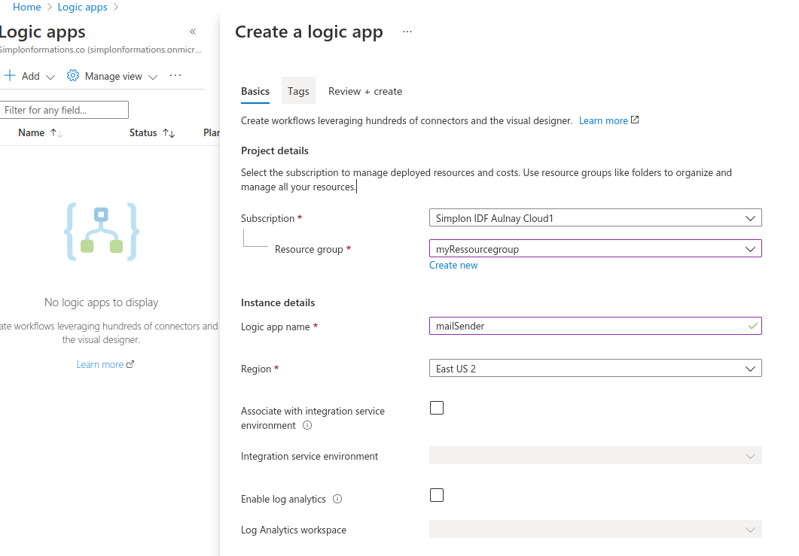
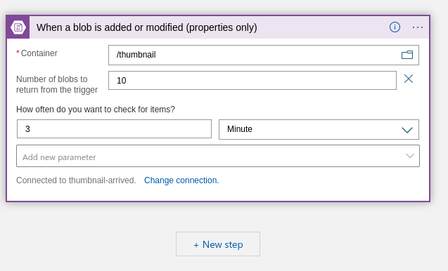
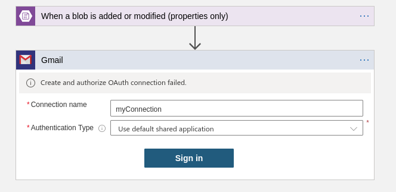

---
title: logic app page
layout: template
filename: LOGIC-APP.md
--- 

## About logic app :

 Our goal is te create a azure logic app to send us a mail automoticaly when a thumbnail image are added in our container.

 ### To do list :

 1. Go to your ressource groupe and select logic app service :

- in your ressource groupe
- in your localisation (here "EAST US 2")

 

2.app creation :

- select Blank logic app
- create a trigger in our thumbnail container like :

 

- + New Step :
- select mail sender :

 

 - Sign in with your Gmail address and login.
(you can change for another server than gmail as you wish.)

- allow access security in your storage account:

https://support.google.com/accounts/answer/6010255?hl=en#zippy=%2Cif-less-secure-app-access-is-on-for-your-account

- save it !

### and we are good to go !!